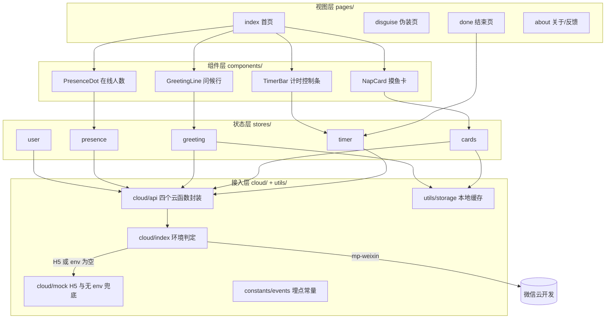
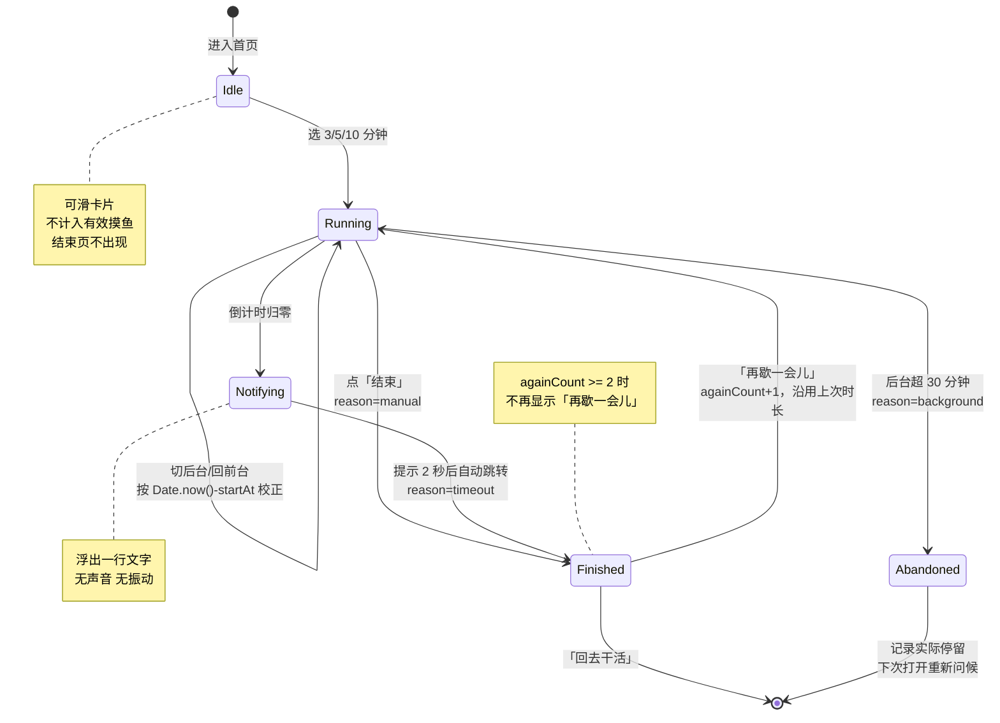

# 小憩一下 · MVP 一期 · 设计文档

- PRD 地址：`/Users/dengmengzhi/Documents/project/try/小憩一下 · 第一期（MVP）需求文档.md`（上位文档：同目录《小憩一下 · 产品规划文档.md》）
- Figma 地址：无。用户选择「启用 frontend-design 设计」，视觉方案见第 5.1 节，作为后续 Figma 稿的依据
- 架构文件：无（空仓库，本次新建 `docs/ARCHITECTURE.md`）
- 创建日期：2026-09-20
- 需求负责人：@dengmengzhi

**本次交付范围**（已与用户确认）：脚手架 + 4 页骨架。对应 PRD 第 1 周交付物，不实现 F1~F5 业务逻辑。

---

## 0. 已确认的决策

三个待定问题已由用户在 2026-09-20 确认，以下为最终口径。

### D1（合规）「摸鱼」全部改为「小憩」— 已确认

PRD 的功能描述与上线清单原本互相打架：F4 写「此刻有 N 人在**摸鱼**」、结束页写「再**摸**一次」，但「提审前清单」要求**全站搜索无「摸鱼」字样**。按更严格的上线清单执行：

| 位置 | PRD 原文 | 最终采用 |
| --- | --- | --- |
| F4 在线人数 | 此刻有 41 人在摸鱼 | 此刻 41 人在小憩 |
| F4 保底文案 | 此刻有几个人在偷偷摸鱼 | 此刻有几个人也在歇着 |
| F1 到点提醒 | 该回去了，今天摸得刚刚好 | 该回去了，今天歇得刚刚好 |
| F1 结束页次按钮 | 再摸一次 | 再歇一会儿 |
| 代码标识符 | — | 不用 `fish`/`moyu`，统一 `rest`/`nap` |

产品内部代号「摸鱼搭子」仅存在于产品文档，不进代码、不进构建产物。由 `scripts/check-forbidden.mjs` 强制（R1/R2）。

### D2（技术栈）create-uni 脚手架 + Pinia + tcb 管云函数 — 已确认

| PRD 原方案 | 最终采用 | 影响 |
| --- | --- | --- |
| 原生小程序 | **create-uni** 起 uni-app 工程（Vue 3 + Vite + TS） | 构建走 `@uni-helper/unh` 而非官方 `uni` CLI，见 5.7 |
| `app.globalData` + 事件总线 | **Pinia** | 状态可测、可持久化；见 5.3 |
| **Skyline 渐进使用** | **不开启** | 已确认。避免与卡片自定义手势冲突，留到 V1 再评估 |
| 云函数随小程序产物上传 | **CloudBase CLI（tcb）** | 云函数脱离小程序产物独立部署，见 5.5.2 |

PRD 本身不回写，偏离只在本设计文档记录。

### D3（工程）tcb 消除了 `project.config.json` 覆盖问题 — 已确认

原本的隐患是：uni-app 每次构建会重新生成 `project.config.json`，在开发者工具里手动设的 `cloudfunctionRoot` 会被覆盖丢失，需要自写 Vite 插件注入。

**改用 tcb 后该问题不复存在**——云函数不再需要进入小程序产物目录，由 `tcb fn deploy` 独立部署。原计划的 `build/vite-plugin-wx-cloud.ts`（原 T17）**取消**。

小程序端仍用 `wx.cloud` 调用云函数，且只在 `mp-weixin` 端存在，故全部调用走条件编译 `#ifdef MP-WEIXIN`，H5 端走 mock（5.5.1）。

## 1. 明确需求

本次只做**工程骨架**，5 个 P0 功能的业务逻辑留待下一轮。骨架必须把后续 5 个功能的"位置"都留出来，避免二次返工。

### 1.1 交付清单

| # | 交付项 | 说明 |
| --- | --- | --- |
| D1 | uni-app CLI 工程 | Vue 3 + TS + Pinia + Vite，`dev:mp-weixin` / `dev:h5` / `build:*` 可跑通 |
| D2 | 4 个页面骨架 | 首页、伪装页、结束页、关于页；路由与跳转打通，真实布局与视觉 token 落地，数据用 mock |
| D3 | Pinia store 分层 | `timer` / `cards` / `greeting` / `presence` / `user` 五个 store，含类型定义与 action 签名，实现留空或 mock |
| D4 | 云开发接入层 | `src/cloud/` 统一封装，mp-weixin 走 `wx.cloud`、H5 走 mock；appid 与 env 留占位 |
| D5 | 云函数目录 | `cloud/functions/{getCards,heartbeat,track,getOnlineCount}`，含 `package.json` 与 handler 骨架 |
| D6 | 内容兜底 JSON | `src/assets/fallback/{greetings,cards}.json`，各放少量示例，结构即正式契约 |
| D7 | 埋点常量与类型 | `src/constants/events.ts`，PRD 事件表逐条落为常量 + 参数类型 |
| D8 | 设计 token | `src/styles/tokens.scss` + `src/uni.scss`，第 5.1 节视觉方案落地 |
| D9 | 测试基建 | Vitest + 首批纯逻辑用例（见第 8 节） |
| D10 | 工程配置 | ESLint + Prettier + tsconfig + `.gitignore` + `docs/ARCHITECTURE.md` |

### 1.2 本次明确不做

- F1~F5 的业务逻辑（计时校正、卡片去重、问候去重、心跳、伪装切换动画）——骨架里只留 TODO 与函数签名
- 真实云函数逻辑（无 env id，无法联调）
- 200 条问候 + 300 张卡的内容生产
- 埋点真实上报（只建常量与 `track()` 空实现）

---

## 2. 需求框架图与状态流转

### 2.1 工程结构



### 2.2 计时器状态流转（F1，骨架需预留状态枚举）

PRD F1 的规则分散在「交互/规则/边界」三处，这里收敛为一张图。**骨架阶段只落状态枚举与迁移函数签名，不实现计时。**



**伪装页不是计时器状态**：PRD 要求「伪装页停留期间计时继续」「返回后卡片位置不变」，所以它是一个**独立的 UI 遮罩层**，不参与上述状态机，也不走路由跳转（见 5.4）。

---

## 3. 项目硬规则

阶段 0 结论：仓库为空，**无** `CLAUDE.md` / `AGENTS.md` / `.cursorrules` / `CONTRIBUTING`，**无** `docs/`，**无**架构文件，**无**测试基建。因此本节规则来自 **PRD 的非功能需求与上线清单**，编码时逐条当 checklist 用。

| # | 规则 | 来源 | 编码时如何落实 |
| --- | --- | --- | --- |
| R1 | 全站无「摸鱼」字样，对外统一「小憩」 | 上线清单 | 提交前跑 `scripts/check-forbidden.mjs` 扫 `src/` 与 `cloud/` |
| R2 | 伪装页无「摸鱼」「小憩」及任何产品名 | F5 验收 | 同上脚本对 `disguise` 目录加严规则 |
| R3 | 无声音、无振动、无弹窗、无红点 | 非功能·隐蔽性 | 禁用 `uni.showToast/showModal/vibrateShort/createInnerAudioContext`，用 ESLint `no-restricted-properties` 拦截 |
| R4 | 配色低饱和 | 非功能·隐蔽性 | 颜色只能取自 `tokens.scss`，ESLint 禁止组件内写裸 hex |
| R5 | 主按钮在屏幕下 40% 区域 | 非功能·可用性 | 布局用 `--safe-action-zone` 变量约束，走查时逐页验证 |
| R6 | 仅使用 openid，不取手机号/位置/头像昵称 | 非功能·隐私 | 禁用 `uni.getUserProfile/getLocation/login` 相关授权 API，同 R3 拦截 |
| R7 | 埋点全部 try/catch，失败静默，不影响主流程 | 非功能·稳定性 | `track()` 内部兜底，对外永不 reject |
| R8 | 埋点事件名集中在一个常量文件 | 非功能·可维护 | `src/constants/events.ts`，禁止字面量字符串调用 `track` |
| R9 | 内容全部在云数据库，可不发版更新 | 非功能·可维护 | 本地 JSON 仅作兜底，不作为数据源 |
| R10 | 基础库 ≥ 2.30，iOS 14+ / Android 9+ | 非功能·兼容 | `manifest.json` 声明最低基础库 |
| R11 | 主包 ≤ 1.5 MB，冷启动 ≤ 1.5 s | 非功能·性能 | 构建后跑体积检查；风险见 7.1 |

---

## 4. 复用模块与扩展点

空仓库，无既有代码可复用。复用发生在**外部**：

| 来源 | 复用内容 | 说明 |
| --- | --- | --- |
| `dcloudio/uni-preset-vue#vite-ts` | 官方模板的 `tsconfig` / `shims` / `manifest` / `pages.json` 结构 | 已拉取核对，按其结构组织，但裁剪掉 12 个用不到的平台包 |
| `@dcloudio/types` + `miniprogram-api-typings` | `uni.*` 与 `wx.cloud.*` 类型 | 官方模板未含后者，`wx.cloud` 类型需额外引入 |
| PRD 数据与埋点章节 | `users` / `events` / `cards` / `greetings` / `heartbeat` / `feedback` 六个集合的字段 | 逐字段落为 TS 类型，前后端共用 |

**扩展点**（为 F1~F5 留的口子）：

- `stores/*` 每个 store 暴露完整 action 签名，本次返回 mock，下一轮只换实现不改调用方
- `cloud/api.ts` 四个云函数的入参/出参类型先定死，即为前后端契约
- `components/NapCard` 的 props 已含 `type: 'text' | 'image'`，图文卡本次只留分支

---

## 5. 模块与组件设计

### 5.1 视觉方案「午后工位」

Figma：无。以下即设计依据，后续出 Figma 稿时以此为准。

**取材**：办公室真实物件的低饱和冷调——打印纸、荧光灯、绿植、旧账本。刻意避开当前 AI 生成设计的高频默认（暖奶油底 `#F4F1EA` + 高对比衬线 + 陶土橙 `#D97757`；深黑底 + 酸绿；全大写 eyebrow 标签；统一圆角 + 统一灰阴影的卡片套件）。

**色板**（6 值，全部低饱和，满足 R4）：

| token | 值 | 用途 |
| --- | --- | --- |
| `--paper` | `#E9EAE5` | 页面背景，偏冷的纸灰 |
| `--card` | `#F5F5F1` | 卡片底，比背景亮一档；不用阴影 |
| `--ink` | `#2C322E` | 主文字；带绿灰色相，与 moss 呼应，非纯黑也非套路化的 `#111` |
| `--ink-soft` | `#6E756F` | 分类标签、次要信息、页码点 |
| `--moss` | `#4F6154` | 主色：倒计时、主按钮、选中态 |
| `--ember` | `#B0855A` | **仅**用于在线人数的呼吸点；全站唯一暖色 |

**字体**：小程序端无法安全加载自定义字体——`wx.loadFontFace` 拉网络字体会直接冲击 R11 的「主包 ≤1.5MB / 冷启动 ≤1.5s」。因此只用系统字族：

```
$font-ui: -apple-system, "PingFang SC", "Source Han Sans SC", "Noto Sans CJK SC", "Microsoft YaHei", sans-serif;
```

性格不从字体来，从**字重与字号**来。类型尺度（rpx）：

| 角色 | 字号 | 字重 | 其他 |
| --- | --- | --- | --- |
| 倒计时 / 结束时长 | 140 | 300 | `letter-spacing: -4rpx`；`font-variant-numeric: tabular-nums` 防数字跳动 |
| 问候语 | 36 | 400 | 行距 1.5 |
| 卡片正文 | 34 | 400 | 行距 1.7；单行 ≤ 18 字，满足「line length < 80 字符」 |
| 时长选项 | 30 | 400 | 选中态 moss 实底 |
| 分类标签 / 在线人数 | 24 | 400 | `--ink-soft` |
| 伪装页 | 另成一套 | — | 见 5.4 |

**卡片形态**：不做 SaaS 圆角卡。下一张卡的边缘从右侧露出 8rpx，像一叠纸——左右滑时能直观看到「还有更多」，比 PRD 说的「轻微弹性动效」更传达信息。圆角 8rpx（纸的切角，非 24rpx 的默认圆角），无阴影，只有 1rpx 的 `rgba(44,50,46,.08)` 边线。分类标签是卡片底部一行小字，左对齐，**不做 pill badge**。

**动效**：全站只有**一处**非用户触发的动效——在线人数前的 `--ember` 小圆点，4s 一次的极慢呼吸（`opacity .5 → 1`）。这是「有人陪」的唯一视觉证据，把大胆花在这一处，其余全部安静。尊重 `prefers-reduced-motion`（H5）与系统无障碍设置（小程序端 `uni.getSystemInfoSync().enableDebug` 不适用，用 `uni.getAppBaseInfo()` 的 `theme`/无障碍字段，具体 API 编码时核对文档）。用户触发的动效只有卡片滑动跟手与伪装页 200ms 淡入。

**首页布局**（左对齐为主；PRD 要求单手竖屏，主按钮在下 40%）：

```
┌─────────────────────────┐
│ ◦                     ▤ │  左上 关于 · 右上 伪装（不起眼的文档图标）
│                         │
│ 三点了，脑子该放个风了      │  问候 36rpx / ink
│ ● 此刻 41 人在小憩        │  24rpx / ink-soft，● 为 ember 呼吸点
│                         │
│ ┌───────────────────┐╎  │  ╎ = 下一张卡露出的 8rpx
│ │                   │╎  │
│ │  为什么下午三点      │╎  │  卡片 55% 屏高（PRD F3）
│ │  最容易困？因为…     │╎  │  正文 34rpx / 行距 1.7
│ │                   │╎  │
│ │ 冷知识              │╎  │  24rpx / ink-soft
│ └───────────────────┘╎  │
│                         │
│      ·  ●  ·  ·  ·      │  位置指示，极淡
│ ─ ─ ─ ─ 下 40% 线 ─ ─ ─ │
│   3 分   [5 分]   10 分  │  默认高亮 5 分（PRD F1）
└─────────────────────────┘
```

计时开始后，底部时长选择就地换成倒计时（不改变布局高度，避免跳动）：

```
│ ─ ─ ─ ─ 下 40% 线 ─ ─ ─ │
│         04:32           │  140rpx / 300 / moss / tabular-nums
│          结束            │  次级文字按钮
```

**结束页**：

```
│        5 分 12 秒        │  140rpx / 300 / moss
│   刚好够脑子转个身        │  36rpx / ink
│ ─ ─ ─ ─ 下 40% 线 ─ ─ ─ │
│   ┌─────────────────┐   │  主按钮：moss 实底 / paper 字
│   │    回去干活      │   │
│   └─────────────────┘   │
│       再歇一会儿          │  次按钮：纯文字；againCount>=2 时隐藏
```

### 5.2 页面与路由

`pages.json` 按 PRD 页面清单配置，无 tabBar。

| 页面 | 路径 | 进入方式 | 备注 |
| --- | --- | --- | --- |
| 首页 | `pages/index/index` | 启动页 | 承担 80% 交互；伪装层是本页内的遮罩，非独立路由 |
| 结束页 | `pages/done/done` | `uni.redirectTo`（计时结束）/ `navigateTo`（手动结束） | 用 redirect 避免返回栈里留着计时中的首页 |
| 关于/反馈 | `pages/about/about` | 首页左上角 `navigateTo` | 含 textarea 反馈 + 隐私说明 |
| 伪装页 | `pages/disguise/disguise` | **不走路由** | 见 5.4，实际以组件形式内嵌首页 |

> 注：PRD 页面清单把伪装页列为 `pages/disguise`，但 PRD 技术方案「关键实现点」又写明「用 `wx.redirectTo` 会丢状态，改为同页内两个 view 切换 hidden」。两处以**技术方案**为准：目录仍叫 `disguise`，但导出的是组件而非页面，且**不注册进 `pages.json`**。

### 5.3 Pinia store 分层

替代 PRD 的 `app.globalData` + 事件总线（见 Q2）。每个 store 本次只落类型与 action 签名。

| store | state | 关键 action（本次仅签名 + mock） | 对应 |
| --- | --- | --- | --- |
| `timer` | `status: TimerStatus`、`duration`、`startAt`、`againCount`、`elapsedSeconds` | `start(d)` / `finish(reason)` / `syncFromBackground()` / `again()` | F1 |
| `cards` | `list: NapCard[]`、`index`、`seenIds`、`isOffline` | `fetch(excludeIds)` / `next()` / `prev()` / `resetSeen()` | F3 |
| `greeting` | `text`、`slot: TimeSlot`、`shownIdsToday` | `pick()` / `resolveSlot(date)` | F2 |
| `presence` | `count`、`showExact: boolean` | `startHeartbeat()` / `stopHeartbeat()` / `refresh()` | F4 |
| `user` | `openid`、`isNew`、`source` | `silentLogin()` | F5 |

**持久化**：`cards.seenIds`、`greeting.shownIdsToday`、`timer` 快照走 `utils/storage.ts` 封装的 `uni.setStorageSync`，**不引第三方持久化插件**（主包体积，R11）。

**为什么 timer 用 store 而非组件内 state**：PRD 要求伪装页停留期间计时继续、切后台回来按真实时间差校正、结束页要读实际时长——跨组件跨页面，必须提到 store。

### 5.4 伪装层（F5）

- 形态：首页内的全屏遮罩组件 `components/DisguiseLayer`，`v-show` 切换（非 `v-if`，避免重建导致卡片位置丢失），过渡 200ms 淡入，满足「切换 ≤ 300ms」
- 内容：静态「项目周报」，**刻意脱离整套设计语言**——纯白 `#FFFFFF` 底、系统默认字、1.5 行距、左对齐、一个假表格、假日期。反差本身就是设计，也是隐蔽性的关键
- 文案红线：R2，不得出现产品名、「小憩」「摸鱼」「专注」等字样；占位文字用中性的项目管理措辞
- 返回：右上角同位置的小图标，返回后首页 DOM 未卸载，卡片 index 与倒计时自然保持
- 审核口径：PRD 要求提审描述中称为「专注模式」——这是**审核材料**里的说法，不是 UI 文案，代码与界面里都不出现该词

### 5.5 云开发接入层

#### 5.5.1 环境判定与 mock

appid 与云开发 env id 本次留空，所以接入层必须在**无 env**时也能跑通：

```
src/cloud/
  index.ts     # init()：读 env.ts；为空或非 mp-weixin → 标记 mock 模式
  env.ts       # APPID = ''  CLOUD_ENV = ''   ← 占位，拿到后只改这一处
  api.ts       # getCards / heartbeat / getOnlineCount / track，统一出入参类型
  mock.ts      # 读 assets/fallback/*.json，返回同构数据
  types.ts     # 六个集合的字段类型，前后端共用
```

`wx.cloud` 仅 mp-weixin 存在，全部调用包在 `// #ifdef MP-WEIXIN` 内；H5 端走 `mock.ts`，这样 `dev:h5` 能直接在浏览器里看 UI，也是阶段 3 用 playwright 截图做 UI 自检的前提。

#### 5.5.2 云函数：CloudBase CLI（tcb）独立部署

云函数**不进小程序产物**，由 `@cloudbase/cli` 独立管理与部署。目录：

```
cloudbaserc.json          # tcb 配置，envId 留占位
cloud/functions/
  getCards/{index.js,package.json}
  heartbeat/{index.js,package.json}
  getOnlineCount/{index.js,package.json}
  track/{index.js,package.json}
```

- 部署：`pnpm cloud:deploy`（即 `tcb fn deploy --all`），不经过微信开发者工具
- 依赖：各云函数独立 `package.json`，依赖 `wx-server-sdk`
- `cloud/` 在仓库根、不在 `src/` 下，因此天然不会被打进小程序主包（关系到 R11 主包体积）
- CLI 已实测可用：`npx -p @cloudbase/cli tcb --help` 正常，提供 `fn` / `env` / `db` / `storage` / `login` 等子命令

**本轮限制**：env id 为空，无法 `tcb login` 与实际部署，只交付配置骨架与 handler 骨架。拿到 env id 后改 `cloudbaserc.json` 与 `src/cloud/env.ts` 两处即可部署，届时需验证微信云开发环境在 tcb 侧的登录授权方式（微信云开发环境与腾讯云 CloudBase 环境的账号打通需实际验证，记为遗留项）。

### 5.6 埋点常量（R8）

`src/constants/events.ts` 把 PRD 事件表逐条落为常量 + 参数类型（`app_open` / `greeting_show` / `online_show` / `timer_start` / `timer_end` / `timer_choice` / `card_view` / `card_dwell` / `disguise_on` / `disguise_off` / `feedback_submit`），`track(event, payload)` 的 payload 按事件名做判别联合类型，写错字段类型检查就报错。

本次 `track()` 只落**空实现 + try/catch 兜底**（R7），PRD 的「攒 5 条或 10 秒发一次、onHide 强制发送」留到第 4 周。

### 5.7 工具链与版本（已实测，非凭记忆）

工程由 `create-uni@2.17.1` 生成：

```
npx create-uni@2.17.1 <name> --ts -m pinia -m vitest -e
```

注：`-m` 必须分开传，`-m pinia,vitest` 会报「暂不支持」；`-t base` 亦不受支持，用默认模板。

**跟随 create-uni 锁定的版本组合**（它是被上游验证过能协同工作的整体，优于自行拼装）：

| 包 | 版本 | 说明 |
| --- | --- | --- |
| `@dcloudio/*` | `3.0.0-5020420260813003` | uni-app 的 Vue 3 线。注意 npm `latest` 标签是 **Vue 2** 线（`2.0.2-x`），装错会全盘失败 |
| `vue` | `3.4.21` | 模板锁定 |
| `pinia` | `2.2.4` | 模板锁定；与 vue 3.4.21 匹配 |
| `vite` | `5.2.8`（**精确锁定**） | `@dcloudio/vite-plugin-uni` 的 peerDependency 就是精确值，不可改 |
| `typescript` | `5.9.3` | 模板锁定 |
| `vue-tsc` | `^3.3.11` | 模板锁定 |
| `sass` | `1.64.2` | tokens 与 `uni.scss` 需要 |
| `@uni-helper/unh` | `^0.3.2` | **构建 CLI**，替代官方 `uni`：`unh dev wx` / `unh build wx` |
| `@uni-helper/plugin-uni` | `0.1.0` | 替代 `@dcloudio/vite-plugin-uni` 在 vite.config 中的位置 |
| `vitest` | **`3.2.4`（降级，见下）** | 模板默认给 4.1.10，**实测不可用** |

**从模板裁剪掉的依赖**：

- 14 个用不到的平台包（`uni-mp-alipay` / `baidu` / `toutiao` / `qq` / `kuaishou` / `lark` / `jd` / `xhs` / `harmony` / `quickapp-webview` / `uni-app-plus` / `uni-app-harmony` 等），只留 **`uni-mp-weixin` + `uni-h5`**（体积，R11）
- `vue-router`（小程序不用）、`vue-i18n`（单语言）、`@mini-types/alipay`

#### 5.7.1 实测地雷：vitest 4 + vite 5 装得上但跑不起来

create-uni 默认给 `vitest@4.1.10`，与锁定的 `vite@5.2.8` 组合后：

- **安装期不报错**——模板 `.npmrc` 里的 `strict-peer-dependencies=false` 压制了 peer 告警，pnpm 把 vite 5.2.8 直接塞给 vitest 4
- **运行期直接崩**：`ERR_PACKAGE_PATH_NOT_EXPORTED: Package subpath './module-runner' is not defined`。vitest 4 依赖 vite 6+ 才有的 `module-runner` 导出

处置：**降级到 `vitest@3.2.4`**——它把 vite 作为 dependency（范围 `^5 || ^6 || ^7`）且无 vite peer，是能与锁定的 vite 5.2.8 共存的最新版本。已实测：依赖树只有一份 `vite@5.2.8`，用例正常通过。

#### 5.7.2 测试环境：不用 `vitest-environment-uniapp`

create-uni 的 vitest 模块装的是 `vitest-environment-uniapp`，其示例用例是 `program.currentPage()` / `page.$()` ——那是**基于微信开发者工具自动化的 E2E**，需要开发者工具在跑，不是纯单元测试。

本轮的测试点（第 9 节 A1~A11）全是**纯逻辑函数**，因此：

- 移除 `vitest-environment-uniapp` 依赖与模板自带的 E2E 示例用例
- `vitest.config.ts` 用 `environment: 'node'`
- E2E 留到有 appid、能真机/工具联调之后再议（遗留项）

---

## 6. 影响点

空仓库，**无既有功能会被破坏**。需要留意的是对**后续几周**的影响：

| 影响对象 | 影响 | 处理 |
| --- | --- | --- |
| PRD 第 2~4 周排期 | 骨架若留错扩展点，F1~F5 要返工 | store action 签名与云函数出入参类型本轮定死，即契约 |
| PRD「主包 ≤1.5MB」 | uni-app runtime 比原生大 | 本轮构建后立即量一次基线体积，见 7.1 |
| 微信开发者工具配置 | 产物目录是 `dist/dev/mp-weixin` 而非项目根 | 写进 README 与 ARCHITECTURE |
| 云开发集合设计 | 前端类型即集合字段 | `cloud/types.ts` 与 PRD 数据章节保持单一来源 |
| 内容生产（第 1 周并行） | CSV 导入脚本依赖 cards/greetings 字段 | 兜底 JSON 的结构即正式契约，内容同学照此产出 |

---

## 7. 已知风险

### 7.1 主包体积（高）

PRD 要求主包 ≤ 1.5 MB，但该指标是按**原生小程序**定的。uni-app 会额外引入 Vue 3 runtime + uni runtime，典型空工程产物约 **300~500 KB**。加上 Pinia、业务代码、兜底 JSON，1.5 MB 仍有余量但不宽裕。

处理：本轮构建完**立刻量一次空工程基线体积并记录**，若超 600 KB 则提前告警，届时再议（分包 / 裁剪 / 或退回原生）。图文卡的图走云存储 CDN，不进包。

### 7.2 冷启动 1.5 s（中）

uni-app 多一层 runtime 初始化。真机验证要等到有 appid 能真机预览之后，本轮无法验证，记为遗留项。

### 7.3 无 appid / env（低，已知）

本轮不影响骨架交付：H5 端全 mock 可跑，mp-weixin 端可用测试号或"不校验合法域名"预览。拿到后只需改 `src/cloud/env.ts` 与 `manifest.json` 两处。

---

## 8. 任务清单

> 编码阶段逐条勾选。

**工程搭建**
- [x] T1 `create-uni@2.17.1 --ts -m pinia -m vitest -e` 生成工程，裁剪 14 个多余平台包与 `vue-router`/`vue-i18n`/`@mini-types/alipay`
- [x] T2 `tsconfig.json` 裁剪 `types`（去 alipay 与 `vitest-environment-uniapp/types`），修正 `includes` 拼写为 `include`
- [x] T3 `vite.config.ts`（`@uni-helper/plugin-uni`）与 `unh.config.ts`：默认平台、`wx` 别名
- [x] T4 `manifest.json`：appid 留空、最低基础库 2.30、**删除整个 `app-plus` 节点**（其默认 Android 权限含 `VIBRATE`/`CAMERA`/`READ_PHONE_STATE`/`GET_ACCOUNTS`，与 R3/R6 相悖）、关闭 darkmode；`pages.json` 配 3 个页面、无 tabBar
- [x] T5 ESLint + Prettier，含 R3/R4/R6 的 `no-restricted-*` 规则
- [x] T6 `.gitignore`（`node_modules`、`dist`、`unpackage`、`cloud/functions/*/node_modules`、`.env*`）
- [x] T7 `scripts/check-forbidden.mjs`（R1/R2 字样扫描）

**设计 token 与样式**
- [x] T8 `src/styles/tokens.scss`：5.1 的色板、类型尺度、`--safe-action-zone`
- [x] T9 `src/uni.scss` 接入 tokens；`App.vue` 全局基样式

**状态层**
- [x] T10 `src/stores/` 五个 store，含 `TimerStatus` 枚举与 2.2 的迁移函数签名
- [x] T11 `src/utils/storage.ts` 本地缓存封装
- [x] T12 `src/utils/time.ts`：时段判定 `resolveSlot()`、时长格式化 `formatDuration()`

**接入层**
- [x] T13 `src/cloud/{index,env,api,mock,types}.ts`
- [x] T14 `src/constants/events.ts` 埋点常量 + 判别联合类型 + `track()` 兜底空实现
- [x] T15 `src/assets/fallback/{greetings,cards}.json` 示例数据
- [x] T16 `cloud/functions/{getCards,heartbeat,getOnlineCount,track}` handler 骨架
- [x] T17 `cloudbaserc.json`（envId 占位）+ `cloud:deploy` script；~~原 Vite 插件方案已取消（D3）~~

**页面骨架**
- [x] T18 首页：问候行 + 在线人数 + 卡片区 + 底部计时条（布局到位，数据 mock）
- [x] T19 `components/NapCard`：纸叠形态、左右滑跟手、分类标签
- [x] T20 `components/DisguiseLayer`：周报外观，`v-show` 切换，200ms 淡入
- [x] T21 结束页：大号时长 + 鼓励语 + 双按钮（下 40% 区）
- [x] T22 关于/反馈页：产品说明 + textarea + 隐私说明

**测试**
- [x] T23 `vitest.config.ts` 降级至 vitest 3.2.4、`environment: 'node'`、移除 `vitest-environment-uniapp` 与 E2E 示例用例（5.7.1 / 5.7.2）
- [x] T24 按第 9 节写首批用例，每条验证过能失败

**收尾**
- [x] T25 `docs/ARCHITECTURE.md`（分层、依赖方向、目录约定、产物路径）
- [x] T26 `README.md` 补开发指引（含开发者工具指向 `dist/dev/mp-weixin`）
- [x] T27 量主包基线体积并记录（7.1）

---

## 9. 验收用例与测试点

### 9.1 自动化测试（Vitest，本轮必须覆盖）

只测纯逻辑，不测 UI 与胶水代码。运行环境为 `node`（原因见 5.7.2），vitest 版本 `3.2.4`（原因见 5.7.1）。每条新用例都要**先验证它能失败**（改坏实现看变红）。

| # | 被测 | 用例 |
| --- | --- | --- |
| A1 | `resolveSlot(date)` | 6 个时段各取边界值两端：`06:00`/`09:29`/`09:30`/`11:29`/`11:30`/`13:29`/`13:30`/`15:29`/`15:30`/`18:29`/`18:30`/`05:59`；跨零点的夜间段单独验 |
| A2 | `resolveSlot(date)` 周末 | 周六/周日返回 `weekend`，优先级高于时段 |
| A3 | `formatDuration(s)` | `0` / `59` / `60` / `312`（→「5 分 12 秒」）/ `3600` |
| A4 | 倒计时格式化 `mm:ss` | `0` → `00:00`；`312` → `05:12`；不足两位补零 |
| A5 | 计时校正 | 给定 `startAt` 与 mock 的 `Date.now()`，切后台 2 分钟后剩余时间正确减去 120 s（对应 PRD F1 验收第 2 条） |
| A6 | 后台超时判定 | 后台 29m59s → 仍 Running；30m01s → Abandoned |
| A7 | `againCount` 规则 | 0/1 次时「再歇一会儿」可见；第 2 次后不可见（PRD F1 验收第 4 条） |
| A8 | 问候去重 | 同一天连续取 10 次不重复；已展示 id 列表耗尽后正确重置（PRD F2 验收第 2 条） |
| A9 | 在线数保底文案 | `N=0..4` → 保底文案且 `showExact=false`；`N=5` → 显示具体数字（PRD F4 验收第 3 条） |
| A10 | 卡片去重与重置 | 取 20 张不含 `seenIds`；全部看完后 `seenIds` 重置 |
| A11 | `track()` 兜底 | 上报函数抛错时 `track()` 不 reject、不抛出（R7） |
| A12 | 问候 store 首次使用 | 首次显示固定欢迎语，且不请求文案库 |
| A13 | 问候 store 耗尽重取 | **阶段 3 发现的缺陷**：候选集由服务端按 excludeIds 过滤，耗尽后必须重新拉取，在空数组上重试取不到（详见 11.2） |
| A14 | 问候 store 异常回落 | 请求失败时回落欢迎语，顶部不留空行 |

`Date.now()` 与随机数用 `vi.useFakeTimers()` / `vi.spyOn(Math, 'random')` mock，不 mock 被测函数自身。

### 9.2 手工验收（本轮走查）

| # | 用例 | 通过标准 |
| --- | --- | --- |
| M1 | `pnpm dev:h5` | 浏览器可打开首页，4 个页面/层均可达，无控制台报错 |
| M2 | `pnpm dev:mp-weixin` | 产物生成于 `dist/dev/mp-weixin`，开发者工具可导入（appid 用测试号） |
| M3 | `pnpm build:mp-weixin` | 构建成功；产物含 `cloudfunctions/` 且 `project.config.json` 的 `cloudfunctionRoot` 正确（5.5.2） |
| M4 | 类型检查 | `pnpm type-check` 零错误 |
| M5 | lint | `pnpm lint` 零报错 |
| M6 | 字样扫描 | `pnpm check:forbidden` 通过（R1/R2） |
| M7 | 视觉走查 | 4 页配色仅取自 tokens；主按钮均在下 40%；无弹窗/红点/声音/振动（R3/R4/R5） |
| M8 | 伪装层 | 首页切换后卡片 index 与底部状态不变；伪装层内无产品名（R2） |
| M9 | 主包体积 | 构建后量取并记录基线（7.1），超 600 KB 则告警 |

**本轮不验收**（无 appid/env，留待后续）：真机冷启动 1.5 s、云函数联调、心跳同步、真机兼容性。

### 9.3 基线

空仓库，无既有测试与 lint 报错，因此本轮基线为**全绿**——所有检查必须零错误，不适用「相比基线无新增失败」的放宽口径。

---

## 10. 遗留项

- [ ] appid 与云开发 env id（拿到后改 `src/cloud/env.ts` + `manifest.json`）
- [ ] 云函数真实逻辑与联调（第 4 周）
- [ ] 200 条问候 + 300 张卡内容入库（第 5 周）
- [ ] 埋点批量上报策略（攒 5 条 / 10 秒 / onHide 强发）
- [ ] 真机性能验证（冷启动、帧率、弱网）
- [ ] Figma 稿（如出稿，以 5.1 为依据，届时走 figma-match 还原）
- [ ] 微信云开发环境在 tcb CLI 侧的登录授权方式待实际验证（5.5.2）
- [ ] E2E 测试（`vitest-environment-uniapp` 或 uni-automator），需开发者工具与 appid（5.7.2）

---

## 11. 实施记录（2026-09-20）

### 11.1 与设计的偏离

| 项 | 设计文档原定 | 实际 | 原因 |
| --- | --- | --- | --- |
| T17 Vite 插件 | 自写插件注入 `cloudfunctionRoot` | **取消** | 改用 tcb 后云函数不进小程序产物，问题不存在（D3） |
| 云函数数量 | 4 个 | **5 个**，增加 `getGreetings` | 问候文案同样走云函数，与 cards 的取数方式保持一致 |
| 卡片高度 | 固定 `55vh` | `flex: 0 1 55vh` 可压缩 | 固定高度会把底部控制条挤出屏幕，违反 R5，详见 11.2 |
| 结束页主按钮定位 | `height: 60vh` 撑开 | flex 自适应 + `margin-top: auto` | 写死 vh 在小屏上让按钮正好卡在 40% 分界线 |
| 测试环境 | 纯 node | node + **内存版 uni storage 桩** | 没有桩时 `storage.ts` 的 try/catch 会吞掉一切，依赖持久化的分支全测不到 |

### 11.2 阶段 3（UI 还原）发现并修复的缺陷

真机布局与实际运行暴露了三个静态检查发现不了的问题：

1. **底部控制条被挤出屏幕（违反 R5）**
   卡片固定 `55vh` 加上顶部内容后总高超过 `100vh`，时长选项被推到屏幕外，主按钮完全不可达。
   改为卡片区可压缩 + 操作区 `margin-top: auto` 钉底。实测时长选项落在 90%、结束页主按钮落在 81%，均在下 40% 区内。

2. **问候语整行为空**
   `mock.getGreetings` 在**请求时**就按 `excludeIds` 过滤，当天该时段文案看完后返回空数组；而 store 里「耗尽就清空重来」是在那个已经空了的数组上重试，于是永远取不到，顶部留白。
   改为耗尽时清空去重列表并**重新拉取**。已补回归测试 A13，并验证过：回滚修复即变红，还原即变绿。
   单测原先只覆盖 `pickUnseen` 纯函数，覆盖不到这层交互 —— 这类缺陷只能靠跑起来发现。

3. **底部操作区未避让安全区**
   时长选项距屏幕底仅 22px，iPhone 的底部手势条会压住。已补 `env(safe-area-inset-bottom)`。

另外 `finish()` 补了一行按真实时间定格 `now`，否则结束页读到的是上一次 tick 的旧值，实际时长会显示为 0 秒。

### 11.3 已知的未实现行为（本轮交付范围内的有意留空）

- **倒计时静止**：驱动 `tick()` 的 `setInterval` 是下一轮的 TODO，界面上倒计时会停在初始值
- 卡片左右滑手势未接（当前只能看到第一张）
- 到点提示行与 2 秒后自动跳转未实现
- 埋点只有常量与兜底空实现，不产生任何上报
- 心跳与在线数走 mock 固定返回 41
